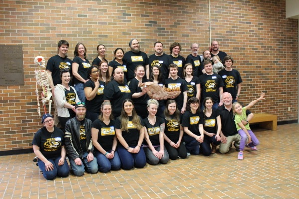
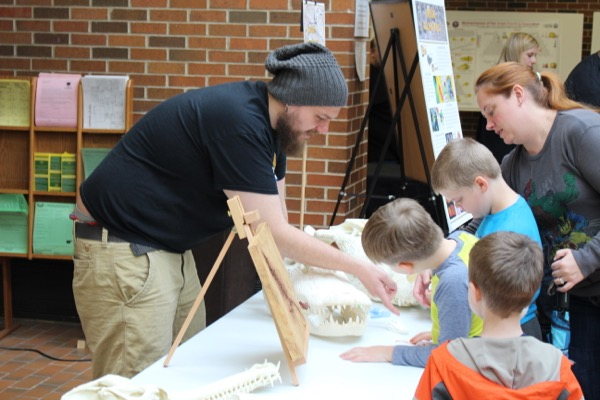
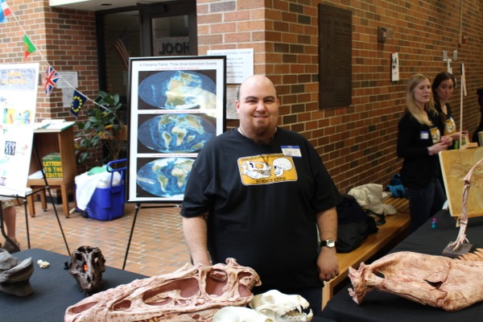
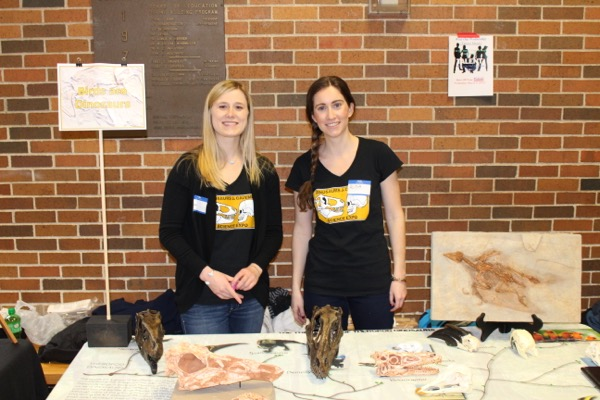
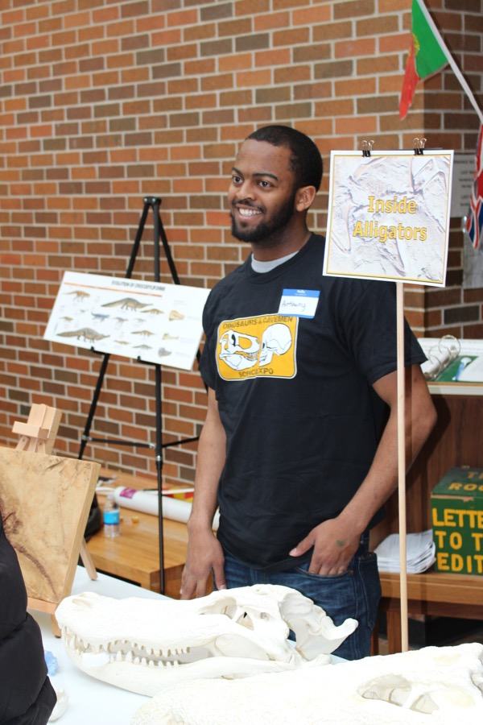
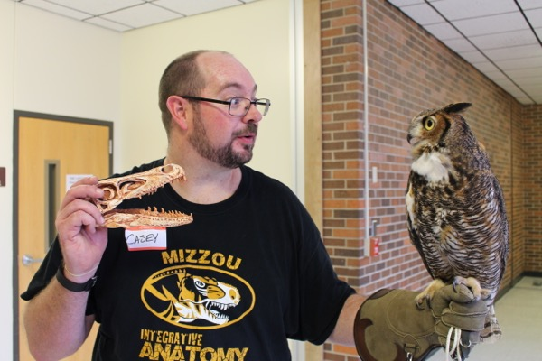
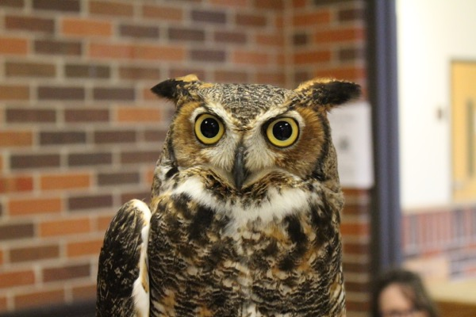

IA's 4th annual [Dinosaurs and Cavemen Science Expo](https://www.facebook.com/media/set/?set=a.1114012398630178.1073741834.105514036146691&type=3) was the largest yet. We had somewhere between 700 and 1000 children and their families comes through our ~15 stations to learn about the evolution of crocodylians, all things Tyrannosaur, the evolution of birds, and living dinosaurs. On the "cavemen" side of things, kids learned about diet in hominins, cave painting, and human biogeography.

