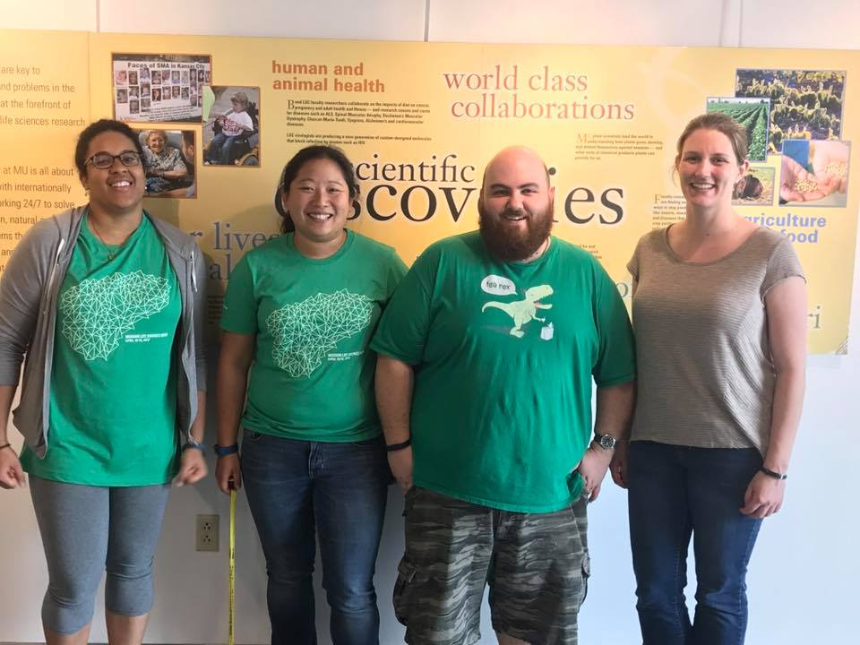
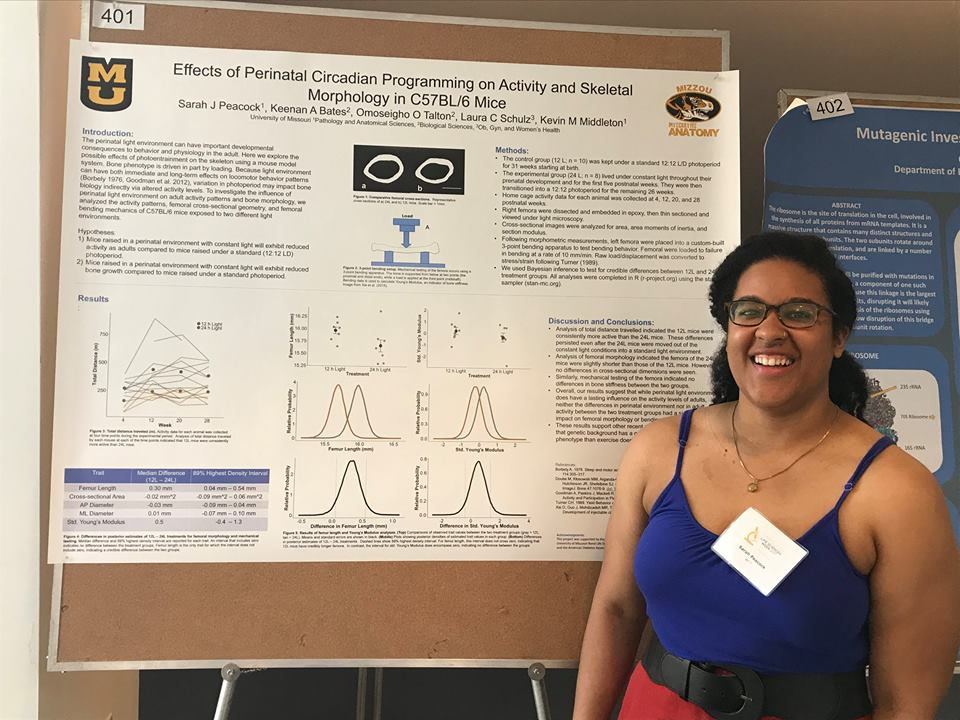
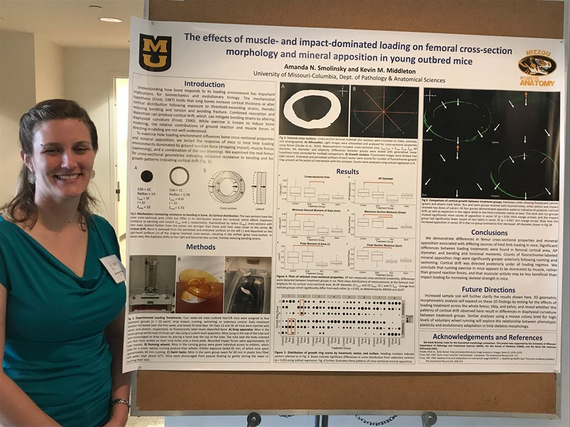
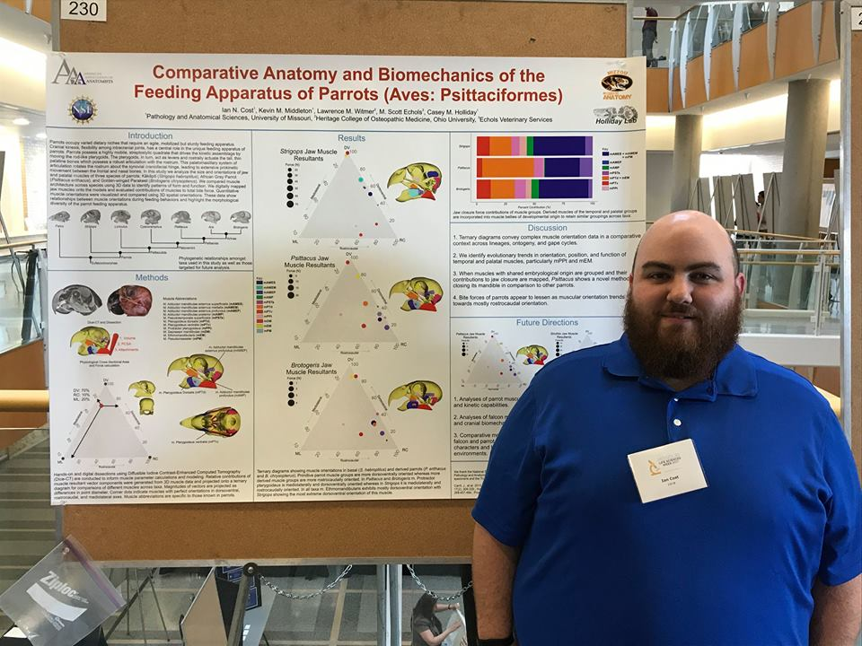
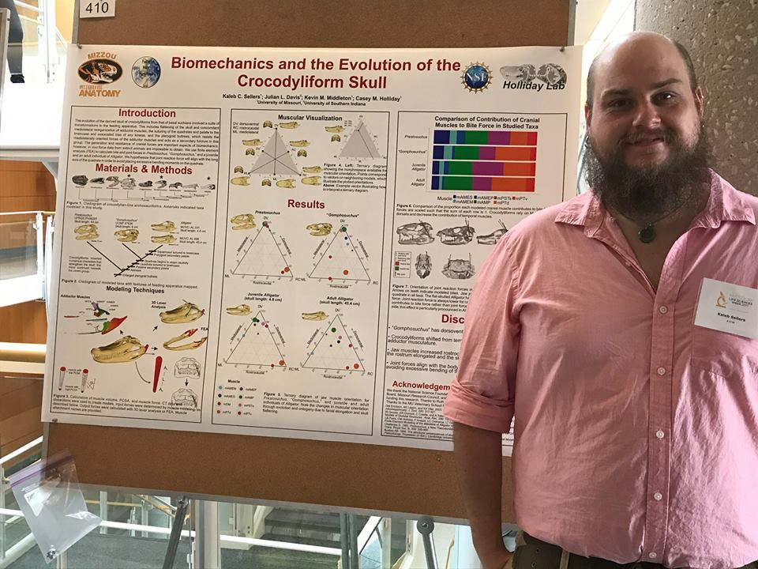
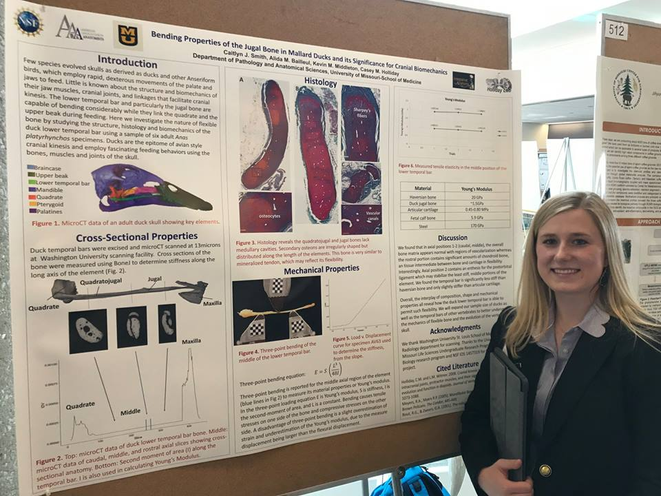
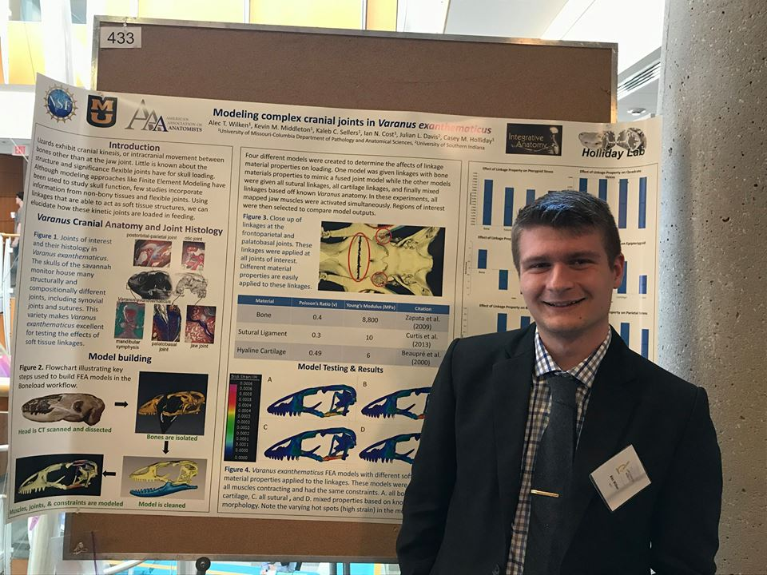

Sarah Peacock and Amanda Smolinsky were both recognized at the 2017 MU Life Sciences Week for their outstanding poster presentations.

In all, four IA students were recognized: Sarah Peacock, Sharon Kuo, Ian Cost, and Amanda Smolinsky:

Many other honorary members presented as well:

