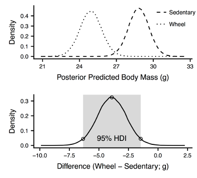
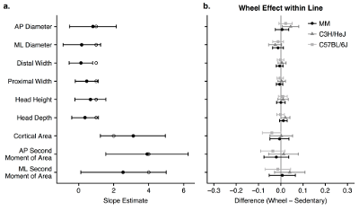

Sarah Peacock's paper "Predicting the bending properties of long bones: insights from an experimental mouse model" was recently accepted for publication in the American Journal of Physical Anthropology. Congratulations Sarah, with coauthors Brittney Coats (David Speer Academy), Kyle Kirkland (Michigan State University), Corwin Tanner (Blivet Solutions), and Ted Garland, Jr. (UC Riverside).

In this paper, we try a new approach for the analysis, Bayesian inference. We preferred this method because it was simpler and more direct that traditional frequestist inference, with the added benefit of being closer to the way that we actually conceptualize such analysis.

We were mainly interested in the differences between groups, which we were able to estimate directly from the posterior samples:

So we had to come up with a method for displaying these posterior summaries:

