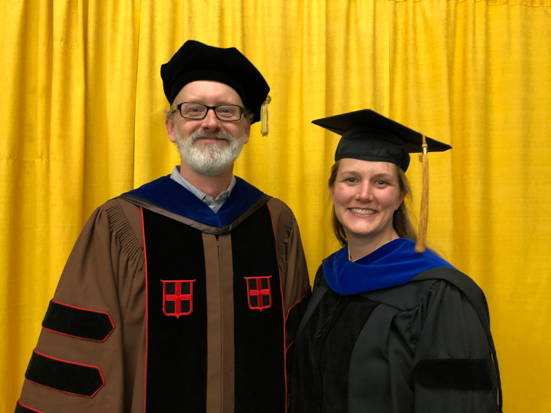

Congratulations to [Dr. Amanda Smolinsky](https://www.middletonlab.org/authors/smolinsky/) on her recent (August) doctoral dissertation defense and graduation from the University of Missouri. Amanda is a Postdoctoral Anatomy Fellow at Rocky Vista University.

Her dissertation was titled "Plastic and evolved morphological responses of the hind limb skeleton to mechanical loading in mice".

<figure>

</figure>
    
<figure>

</figure>
