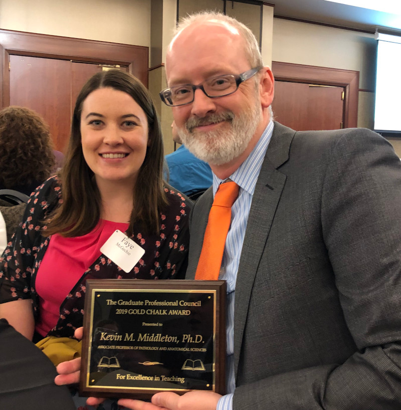

I was really honored to be a recipient of a 2019 [Gold Chalk Award](https://gpc.missouri.edu/services/gold-chalk/) in Natural and Mathematical Sciences for graduate teaching and mentoring. I appreciate being nominated by the IA graduate students for this award.

<figure>

</figure>
