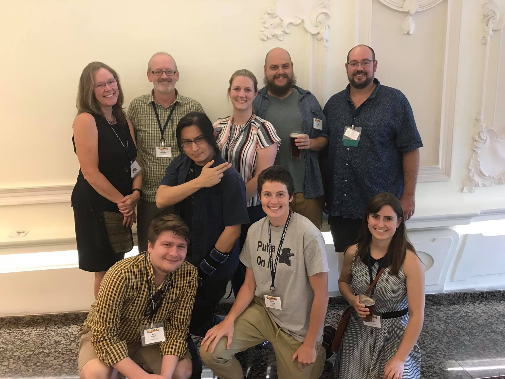
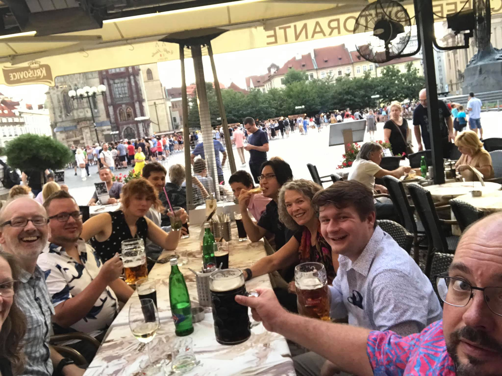

A large contingent of Integrative Anatomy students and faculty attended the International Congress of Vertebrate Morphology conference in Prague.

Lab members (past and present) had many presentations:

- *Methods for Visualizing and Comparing Force Vectors in Two- and Three-Dimensions, with Applications for Vertebrate Feeding and Locomotion* (**Middleton KM**, Sellers KC, Cost IN, Spates AT, Holliday CM)
- *Metabolic and Environmental Factors Shaping the Morphology of Respiratory Turbinates in Mammals and Archosaurs* (**Owerkowicz T**, Poff M, Middleton KM, Crompton AW)
- *Functional Morphology of the Palate in Varanus exanthematicus (Squamata: Varanidae) and Its Significance for the Evolution of Cranial Kinesis* (**Wilken AT**, Middleton KM, Sellers KC, Cost IN, Holliday CM)
- *Morphology and Function of the Avian Furcula* (**Sullivan SP**, Middleton KM, Holliday CM)
- *Joint Loading and Transformation in Suchian Evolution* (**Sellers KC**, Middleton KM, Holliday CM)
- *Effects of Artificial Selection for Increased Voluntary Wheel Running on Hindlimb Skeletal Shape in Mice* (**Smolinsky AN**, Aldridge K, Castro AA, Garland T, Jr, Middleton KM)
- *Connecting the Chondrocranium: Biomechanics of the Palatocranial Joints of Sauropsids* (**Holliday CM**, Wilken AT, Bailleul AM, Sellers KC, Cost IN, Rozin
RE, Middleton KM)

<figure>

<figcaption>IA past (Amanda Smolinsky, Henry Tsai, and Eva Herbst) and present (Carol Ward, Kevin Middleton, Kaleb Sellers, Casey Holliday, Alec Wilken, and Emily Lessner)</figcaption>
</figure>
    
<figure>

<figcaption>IA and friends</figcaption>
</figure>
