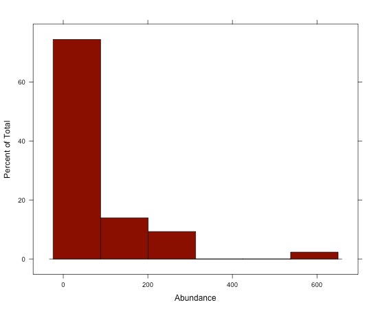
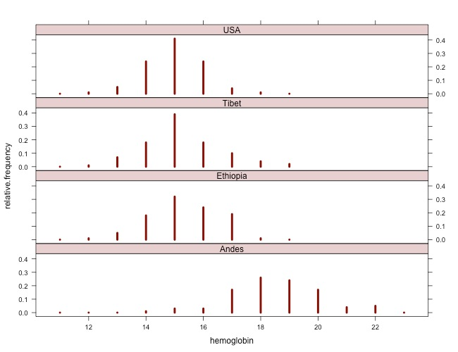
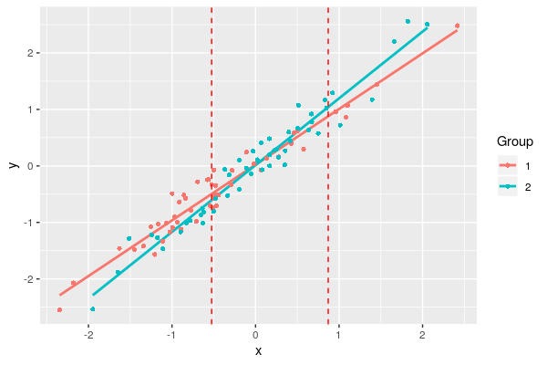

Code for most lab projects is available either on the [lab github page](https://github.com/Middleton-Lab) or [my personal GitHub page](https://github.com/kmiddleton).

A few of the more potentially useful R packages are described below.

- [abd](#analysis-of-biological-data-abd): Data for *Analysis of Biological Data*
- [jnt](#johnsonneyman-technique-jnt): Johnson-Neyman Technique
- [MuscleTernary](#ternary-plots-for-3d-data-muscleternary): Ternary plots for 3D data
- [binning](#binning-for-mouse-wheel-activity-data-binning): Functions for processing mouse activity data

<hr />

## Analysis of Biological Data (`abd`)

Collaborating with Randall Pruim (Calvin College), I co-developed an R package ([`abd`](https://github.com/Middleton-Lab/abd)) to accompany the first edition of [*The Analysis of Biological Data*](https://www.macmillanlearning.com/college/us/product/Analysis-of-Biological-Data/p/1936221489) by Michael Whitlock and Dolph Schluter. This is an excellent textbook (now in its second edition, still remarkably inexpensive) for teaching advanced undergraduate and introductory graduate statistics. The new edition of this book has [associated R code](https://whitlockschluter.zoology.ubc.ca/), mostly making this package redundant. But I still like having the datasets from the book handy. I use them for teaching and demos really often, like the distribution of counts of desert birds or hemoglobin levels in different populations.

<figure>


</figure>

### Installation

The package can be instlled via CRAN

```{r}
install.packages("abd")
```

or directly from Github:

```{r}
devtools::install_github("Middleton-Lab/abd")
```

We have had a lot of dependency creep over the years, so the number of packages that get installed alongside `abd` can be quite large.

<hr />

## Johnson-Neyman Technique (`jnt`)

The Johnson-Neyman technique is used to determine the region of an analysis of covariance where the slopes are not significantly between the covariate. This allows the dermination of bounds of a region of "equal" slope despite the presence of a "significant" slope (by whatever definition of "significant" you choose).

We used this approach in Lavin SR, Karasov WH, Ives AR, Middleton KM, Garland T Jr (2008) Morphometrics of the avian small intestine compared with that of nonflying mammals: A phylogenetic approach. *Physiol Biochem Zool* 81: 526-550.

### References

1. Johnson PO and Neyman J (1936) Tests of certain linear hypotheses and their application to some educational problems. *Statistical Research Memoirs* 1: 57-93.
2. Hunka S and Leighton J (1997) Defining Johnson-Neyman regions of significance in three-covariate ANCOVA using Mathematica. *Journal of Educational and Behavioral Statistics* 22: 361-387.
3. White CR (2003) The influence of foraging mode and arid adaptation on the basal metabolic rates of burrowing mammals. *Physiol Biochem Zool* 76: 122-134.
4. White CR (2003) Allometric analysis beyond heterogenous regression slopes: Use of the Johnson-Neyman Technique in comparative biology. *Physiol Biochem Zool* 76: 135-140.

### Demo

```{r}
library(jnt)

set.seed(1234)

n <- 50

x1 <- rnorm(n)
y1 <- x1 + rnorm(n, sd = 0.2)

x2 <- rnorm(n)
y2 <- 1.25 * x2 + rnorm(n, sd = 0.2)

df1 <- data.frame(x = x1, y = y1)
df2 <- data.frame(x = x2, y = y2)

(jnt.out <- jnt(df1, df2))

plot(jnt.out)
```

<figure>

</figure>

### Installation

`jnt` can be installed directly from Github:

```{r}
devtools::install_github("Middleton-Lab/jnt")
```
<hr />

## Ternary plots for 3D data (`MuscleTernary`)

### Installation

`MuscleTernary` can be installed directly from Github:

```{r}
devtools::install_github("Middleton-Lab/MuscleTernary")
```

<hr />

## Binning for mouse wheel activity data (`binning`)

### Installation

`binning` can be installed directly from Github:

```{r}
devtools::install_github("Middleton-Lab/binning")
```
